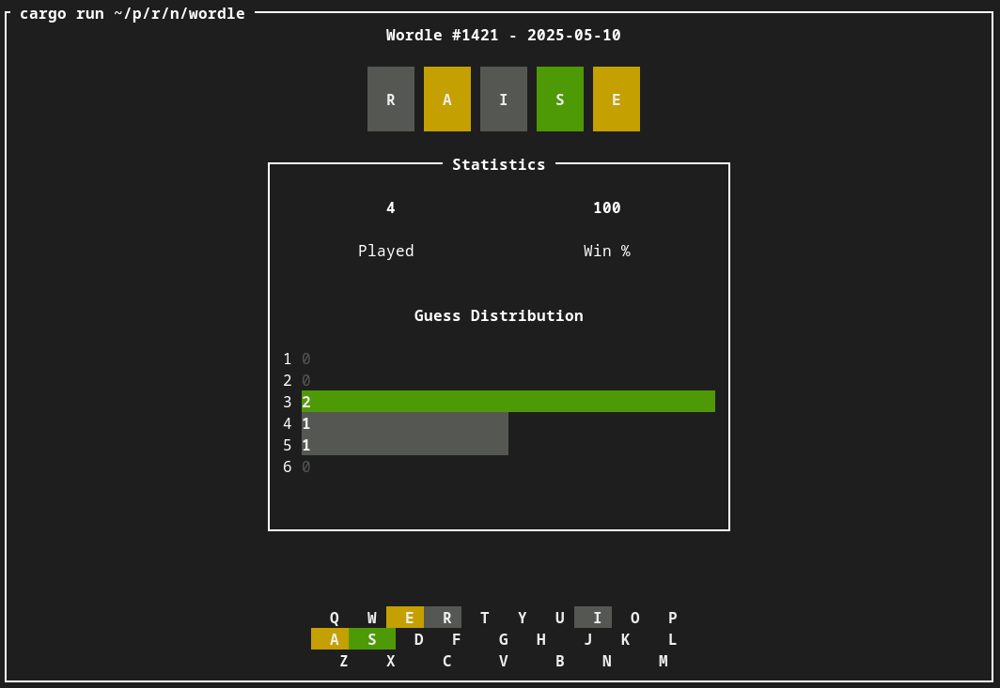

# wordle-rs

Small project to get accustomed with using the [Helix text editor](https://helix-editor.com/),
and to have some fun with Rust!

## Features:
- [x] Game functionality
- [x] Responsive: works for different terminal sizes
- [x] Fetches real Wordle puzzles
  - [x] Use arrow keys to play previous puzzles!
- [x] Saves your progress
- [ ] Stat tracking
